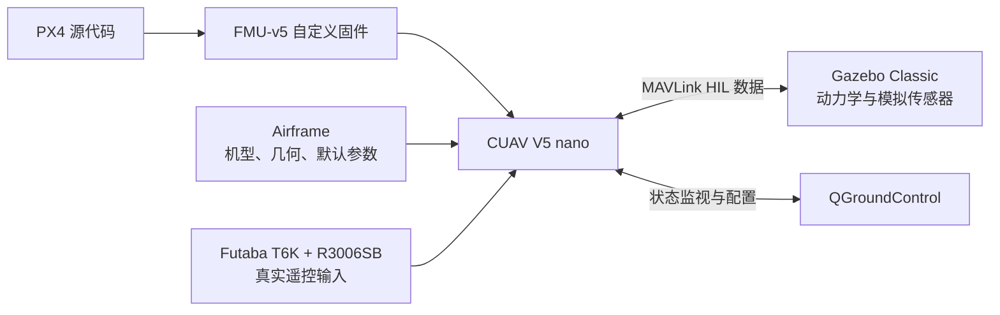
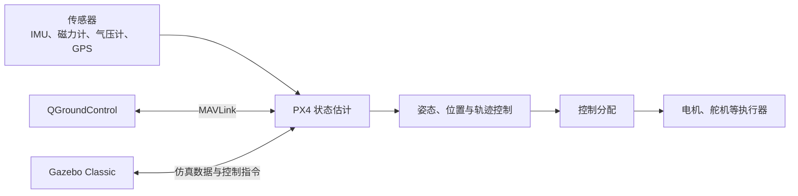
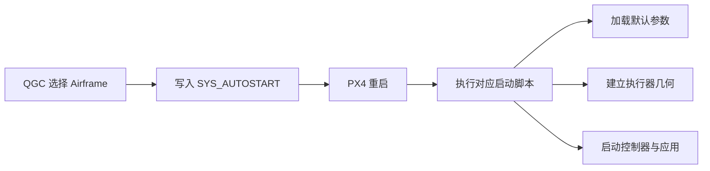
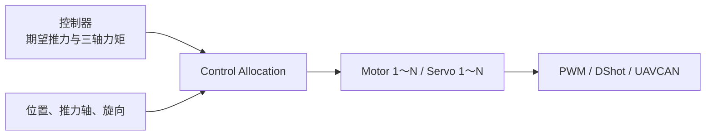
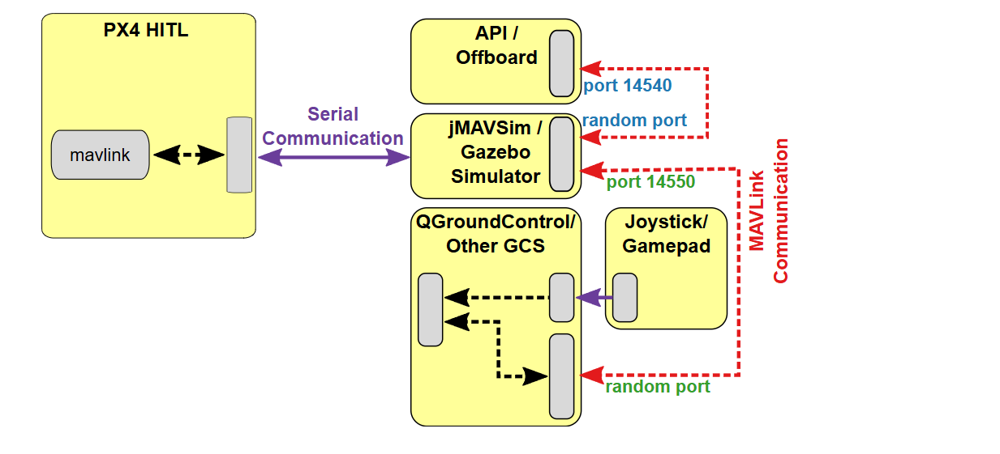

# PX4 自定义固件与 HITL 实践总结

## 0. 内容概览

本阶段工作围绕 CUAV V5 nano 展开，完成了 PX4 自定义固件、Airframe 机架配置和 Gazebo Classic 硬件在环（HITL）验证的学习与实践。



三部分工作的关系如下：

| 部分 | 解决的问题 | 本阶段产出 |
| --- | --- | --- |
| 自定义固件 | PX4 如何编译并运行在 V5 nano 上 | `px4_fmu-v5_default.px4` 的构建与刷写流程 |
| Airframe | PX4 如何确定机型、几何和执行器映射 | Airframe 启动机制、Quad X 几何及自定义脚本方法 |
| HITL | 如何在真实飞控硬件上验证飞行控制链 | Futaba 遥控接入、HITL 固件、Gazebo Classic 验证通过 |

---

## 1. PX4 与自定义固件

### 1.1 PX4 是什么

PX4 是运行在飞控计算机上的开源自动驾驶仪软件平台，负责传感器采集、状态估计、飞行控制、控制分配、任务管理、安全保护和 MAVLink 通信。



| 名称 | 类型 | 作用 |
| --- | --- | --- |
| PX4 | 飞控软件 | 状态估计、控制、任务管理和驱动 |
| CUAV V5 nano | 飞控硬件 | 运行 PX4 固件并连接传感器、执行器 |
| FMU-v5 | 硬件参考架构 | 决定 PX4 的编译目标和板级配置 |
| QGroundControl | 地面站 | 固件刷写、参数配置、校准和状态监视 |
| Gazebo Classic | 仿真环境 | 提供动力学、环境和模拟传感器数据 |

CUAV V5 nano 是具体飞控板，FMU-v5 是其所属的硬件架构，两者不是同一个概念。

### 1.2 PX4 的主要功能层

1. **设备驱动**：读取 IMU、GPS、磁力计和气压计，控制电机与舵机。
2. **状态估计**：融合传感器数据，得到姿态、位置和速度。
3. **飞行控制**：根据目标状态和当前状态计算期望力与力矩。
4. **控制分配**：将期望力与力矩转换为各执行器指令。
5. **任务与安全管理**：管理飞行模式、航点、返航和故障保护。
6. **通信**：通过 MAVLink 与 QGC、仿真器或伴随计算机交换数据。

### 1.3 什么是自定义固件

自定义固件由修改或重新配置后的 PX4 源代码编译得到。常见修改包括：

- 控制器、估计器或控制分配算法；
- 传感器、执行器和通信设备驱动；
- 自定义 PX4 模块与 uORB 消息；
- Airframe、板级配置、默认参数和启动脚本；
- 为 HITL 增加 `pwm_out_sim` 等非默认模块。

建议在独立 Git 分支中维护项目修改：

```text
main                 官方或稳定基线
└── custom-firmware  自定义固件开发分支
```

### 1.4 从源码到 V5 nano

FMU-v5 默认固件的编译命令：

```bash
make px4_fmu-v5_default
```

固件产物：

```text
build/px4_fmu-v5_default/px4_fmu-v5_default.px4
```

`.px4` 文件包含 PX4 程序、板级配置和相关元数据，可通过 QGroundControl 的 **Firmware → Advanced settings → Custom firmware file** 刷入 CUAV V5 nano。

---

## 2. Airframe 机架配置

### 2.1 Airframe 的作用

Airframe 是 PX4 的整机启动配置。它通过一个 ID 选择飞行器类型、执行器几何、默认参数和需要启动的控制模块。

| 对象 | 定义 | 典型内容 |
| --- | --- | --- |
| Airframe | 整机配置入口 | 机型、默认参数、模块和执行器几何 |
| Geometry | 执行器相对重心的空间关系 | 数量、位置、推力轴和旋向 |
| Output Mapping | 逻辑执行器到物理接口的映射 | `Motor 1 → PWM MAIN 1` |
| Tuning | 具体整机的控制参数 | PID、悬停油门和飞行限制 |



Airframe 文件名格式为：

```text
<SYS_AUTOSTART>_<机架名称>
```

例如 `4001_quad_x` 中，`4001` 是机架 ID。QGC 应用机架后写入 `SYS_AUTOSTART`，PX4 在下一次启动时加载相应脚本。

### 2.2 Quad X 几何与 FRD 坐标

PX4 使用 FRD 机体系，坐标原点应取整机重心：

- `+X`：机头（Forward）；
- `+Y`：机体右侧（Right）；
- `+Z`：机体下方（Down）。

```text
                         +X 机头
                            ↑
              Motor 3       │       Motor 1
             (+X, -Y)       │      (+X, +Y)
                      ╲      │      ╱
                       ╲     ●     ╱       ●：整机重心
              -Y 左侧 ──────┼────── +Y 右侧
                       ╱           ╲
                      ╱             ╲
              Motor 2               Motor 4
             (-X, -Y)              (-X, +Y)
                            ↓
                         -X 机尾
```

电机编号、旋向和输出口应以当前固件的 **Actuators → Actuator Testing** 为准，不能按接线顺序或其他飞控系统的编号习惯推断。

### 2.3 控制分配参数



| 参数族 | 含义 | 注意点 |
| --- | --- | --- |
| `CA_ROTOR_COUNT` | 电机数量 | 必须与机体一致 |
| `CA_ROTORn_PX/PY/PZ` | 第 `n+1` 个电机相对重心的位置 | 单位通常为米，使用 FRD 坐标 |
| `CA_ROTORn_AX/AY/AZ` | 电机推力轴方向 | 倾转或非平行布局必须填写正确 |
| `CA_ROTORn_KM` | 反扭矩系数 | 符号反映旋向 |
| `PWM_*_FUNCn` | 物理输出通道功能 | `101` 起通常对应 Motor 1、Motor 2…… |

### 2.4 Airframe 源码位置

| 目标 | 路径 |
| --- | --- |
| NuttX 实机 Airframe | `ROMFS/px4fmu_common/init.d/airframes/` |
| POSIX/SITL Airframe | `ROMFS/px4fmu_common/init.d-posix/airframes/` |
| Airframe 构建清单 | `ROMFS/px4fmu_common/init.d/airframes/CMakeLists.txt` |
| 多旋翼通用默认配置 | `ROMFS/px4fmu_common/init.d/rc.mc_defaults` |
| 系统启动入口 | `ROMFS/px4fmu_common/init.d/rcS` |

Airframe 脚本主要包含元数据、通用默认值、机型专用参数以及特殊模块启动命令。

### 2.5 自定义 Airframe 开发流程

| 阶段 | 核心工作 | 通过条件 |
| --- | --- | --- |
| 固定基线 | 记录 PX4 提交、飞控板、机型和输出协议 | 软件与硬件对象唯一确定 |
| 选择母版 | 选择控制类型一致的 Generic Airframe | 控制链和执行器类型一致 |
| 建立几何 | 填写位置、推力轴、旋向和倾转关系 | 与实机逐项一致 |
| 映射输出 | 分配 Motor/Servo 到输出通道 | 拆桨测试一一对应 |
| 提取差异 | 执行 `param show-for-airframe` | 每项差异来源明确 |
| 固化源码 | 创建 `<ID>_<name>` 并加入 `CMakeLists.txt` | 元数据与构建系统可识别 |
| 构建部署 | 清理、编译、刷写并选择新机架 | QGC 可见且 ID 正确 |
| 回归验收 | 验证启动、执行器、飞行和故障保护 | 无隐藏手工补参步骤 |

机型通用的几何、输出映射、控制增益和安全默认值适合固化；单机传感器校准、设备 ID、遥控器校准、任务和临时调试参数通常不应固化。

> `param set-default` 修改默认值，但飞控中已保存的参数仍可能覆盖它。测试新机架时需要明确参数重置策略。

### 2.6 最小 Airframe 脚本示例

文件名示例：`4999_my_quad_x`

```sh
#!/bin/sh
#
# @name My Quad X
#
# @type Quadrotor x
# @class Copter
#
# @maintainer Your Name <you@example.com>
#

# 加载多旋翼通用默认参数与启动逻辑
. ${R}etc/init.d/rc.mc_defaults

# 定义四个旋翼及其相对重心的位置
param set-default CA_ROTOR_COUNT 4
param set-default CA_ROTOR0_PX 0.15
param set-default CA_ROTOR0_PY 0.15
param set-default CA_ROTOR1_PX -0.15
param set-default CA_ROTOR1_PY -0.15
param set-default CA_ROTOR2_PX 0.15
param set-default CA_ROTOR2_PY -0.15
param set-default CA_ROTOR3_PX -0.15
param set-default CA_ROTOR3_PY 0.15

# 将前四个主输出依次映射为 Motor 1 至 Motor 4
param set-default PWM_MAIN_FUNC1 101
param set-default PWM_MAIN_FUNC2 102
param set-default PWM_MAIN_FUNC3 103
param set-default PWM_MAIN_FUNC4 104
```

首次加入新 Airframe 时执行：

```bash
make clean
make px4_fmu-v5_default
```

也可以将 Airframe 脚本命名为 `rc.autostart`，放入 SD 卡的 `/ext_autostart/rc.autostart` 进行快速验证；正式版本应固化进源码并纳入版本管理。

---

## 3. Gazebo Classic HITL 实践

### 3.1 实验对象与数据链路

| 对象 | 本案例配置 | 作用 |
| --- | --- | --- |
| 飞控 | CUAV V5 nano（FMU-v5） | 在真实 MCU 上运行 PX4 |
| 遥控器 | Futaba T6K | 产生人工控制输入 |
| 接收机 | Futaba R3006SB | 经 S.BUS 向飞控发送多通道数据 |
| 仿真器 | Gazebo Classic | 计算动力学并生成模拟传感器数据 |
| 地面站 | QGroundControl | 配置、监视和飞行模式管理 |



HITL 中 PX4 运行在真实 V5 nano 上，Gazebo Classic 通过 USB/UART 与飞控交换 MAVLink HIL 消息，并通过 UDP 将连接转发给 QGroundControl。Futaba 遥控输入直接通过 S.BUS 进入真实飞控。

### 3.2 第一步：建立 Futaba 遥控链路

连接关系：

```text
Futaba T6K  ──2.4 GHz T-FHSS Air──>  R3006SB  ──S.BUS──>  CUAV V5 nano
                                                    SB/6       DSM/SBUS/RSSI
```

R3006SB 的 `SB/6` 是复用接口，必须设置为 Mode B：

| 模式 | `SB/6` 功能 | 本案例 |
| --- | --- | --- |
| Mode A | 普通 PWM 第 6 通道 | 不使用 |
| Mode B | S.BUS 多通道输出 | 使用 |

Mode B 切换过程：

1. 关闭 T6K，单独给 R3006SB 上电并等待红灯常亮。
2. 按住 `Mode` 键超过 5 秒，在红绿灯同时闪烁时松开。
3. 短按 `Mode` 键切换；红灯闪 2 次表示 Mode B，闪 1 次表示 Mode A。
4. 在 Mode B 下按住 `Mode` 键超过 2 秒，在红绿灯同时闪烁时松开保存。
5. 断电重启接收机并复核 Mode B。

T6K 与 R3006SB 对频：

1. 将 T6K 的 `RX SYSTEM` 设置为 `T-FHSS Air`。
2. 在 `LINK` 页面长按 Jog 键约 1 秒。
3. 给 R3006SB 上电，接收机由红灯闪烁变为绿色常亮即对频成功。
4. 重启接收机，通过摇杆与开关确认仍由当前 T6K 控制。

在 QGC 的 **Vehicle Setup → Radio** 中完成校准，检查四个主通道、行程、中位、开关通道和 RC 失联识别。接线、对频及后续测试期间均应拆除螺旋桨。

### 3.3 第二步：加入并检查 `pwm_out_sim`

`pwm_out_sim` 接收 PX4 的执行器控制结果，按 `HIL_ACT*` 配置生成模拟执行器输出，再通过 MAVLink 送往 Gazebo Classic。

在 QGC 的 **Analyze Tools → MAVLink Console** 中执行：

```sh
pwm_out_sim status
```

| 返回结果 | 判断 |
| --- | --- |
| `command not found` | 当前固件未编译该模块 |
| `not running` | 模块存在但当前机架未启动它 |
| 显示 `HIL_ACT` 和 Channel Configuration | 模块已存在并运行 |

本次实测关键输出：

```text
INFO  [mixer_module] Param prefix: HIL_ACT
INFO  [mixer_module] Switched to rate_ctrl work queue
Channel 0: func: 101
Channel 1: func: 102
Channel 2: func: 103
Channel 3: func: 104
```

Channel 0～3 分别对应 Motor 1～4。Gazebo 尚未连接时出现 `cycle: 0 events` 或 `control latency: 0 events` 属正常现象。

如果模块不存在，在 `boards/px4/fmu-v5/default.px4board` 中启用：

```text
CONFIG_MODULES_SIMULATION_PWM_OUT_SIM=y
```

随后执行：

```bash
make px4_fmu-v5_default
```

#### 实际遇到的问题：Flash 空间超限

加入 `pwm_out_sim` 后，FMU-v5 固件曾因 Flash 空间超限而编译失败。处理方法是在 `default.px4board` 中关闭本次 HITL 明确不需要的驱动、载荷功能或协议，为 `pwm_out_sim` 释放空间。

裁剪时保留 `commander`、参数系统、uORB、MAVLink、估计器、控制器、控制分配和 HITL 依赖模块；每次只裁剪一组并重新编译，通过 Git 记录差异：

```bash
git diff -- boards/px4/fmu-v5/default.px4board
```

编译成功后刷写自定义 `.px4` 固件，重启飞控并再次执行 `pwm_out_sim status` 完成确认。

### 3.4 第三步：机架、遥控通道与 Gazebo 验证

在 QGC 中选择标准四旋翼 HITL 机架：

```text
HIL Quadcopter X
SYS_AUTOSTART = 1001
```

Futaba T6K 的实际通道设置：

| 通道 | 功能 | PX4 参数 |
| --- | --- | --- |
| `CH5` | 飞行模式切换 | `RC_MAP_FLTMODE=5` |
| `CH8` | 解锁/上锁 | `RC_MAP_ARM_SW=8` |

在 QGC 的 **Vehicle Setup → Flight Modes** 中确认 CH5 各档位能切换预期飞行模式，CH8 能识别 Arm/Disarm 位置。设置解锁开关后，PX4 使用 CH8 解锁或上锁，测试时仍需拆除螺旋桨。

HITL 数据闭环：

```text
Gazebo Classic ──模拟 IMU/GPS/气压计等数据──> V5 nano 上运行的 PX4
Gazebo Classic <──────HIL 模拟电机输出────── pwm_out_sim
Futaba T6K ──S.BUS──> V5 nano ──控制量──> Gazebo Classic 四旋翼
```

实际验证结果：

| 验证项 | 结果 |
| --- | --- |
| Gazebo Classic 与 V5 nano 通信 | 成功 |
| PX4 接收模拟传感器数据 | 正常 |
| `pwm_out_sim` 输出模拟电机控制量 | 正常 |
| Futaba CH5 切换飞行模式 | 正常 |
| Futaba CH8 解锁/上锁 | 正常 |
| 遥控摇杆控制 Gazebo 四旋翼 | 正常响应 |

**最终结果：Gazebo Classic 硬件在环验证通过。**

---

## 4. 阶段成果与经验总结

### 4.1 已完成工作

- 理解 PX4、V5 nano、FMU-v5、QGC、Airframe 和 Gazebo Classic 的关系；
- 掌握 `px4_fmu-v5_default` 自定义固件的编译、刷写和模块裁剪方法；
- 理解 `SYS_AUTOSTART`、FRD 坐标、执行器几何和控制分配参数；
- 完成 Futaba T6K 与 R3006SB 的 S.BUS 接入和 QGC 校准；
- 将 CH5 设置为飞行模式切换，将 CH8 设置为解锁/上锁；
- 在真实 V5 nano 上运行 HITL 固件，并通过 Gazebo Classic 完成验证。

### 4.2 关键问题与处理

| 问题 | 原因 | 处理方法 |
| --- | --- | --- |
| `SB/6` 无法输出多通道 S.BUS | R3006SB 处于 Mode A | 切换为 Mode B 并重新上电确认 |
| 固件缺少 `pwm_out_sim` | FMU-v5 默认配置未启用模块 | 在 `default.px4board` 中设置为 `y` |
| 加入模块后编译失败 | 固件超过 FMU-v5 Flash 上限 | 裁剪实验中不用的模块并保留核心依赖 |
| 仿真器未连接时显示 `0 events` | 尚无 HIL 传感器与控制数据 | 建立 Gazebo 串口链路后重新检查 |

### 4.3 核心认识

1. 自定义固件决定“飞控中有哪些程序和功能”。
2. Airframe 决定“PX4 启动成什么机型以及默认如何分配执行器”。
3. `SYS_AUTOSTART` 是 Airframe 的选择入口，`CA_*` 描述执行器几何，`PWM_*_FUNC*` 或 `HIL_ACT_FUNC*` 描述输出功能。
4. HITL 使用真实飞控运行 PX4，但传感器和飞行动力学来自 Gazebo Classic，能够验证硬件、固件、遥控输入和控制链的集成。
5. 实验结论不能只看“模块存在”，必须完成“数据进入—状态估计—控制计算—模拟执行器输出—模型响应”的闭环验证。

---

## 5. 参考资料

- [PX4：添加机架配置](https://docs.px4.io/main/en/dev_airframes/adding_a_new_frame)
- [PX4：系统启动流程](https://docs.px4.io/main/en/concept/system_startup)
- [PX4：执行器配置与测试](https://docs.px4.io/main/en/config/actuators)
- [PX4：机架参考](https://docs.px4.io/main/en/airframes/airframe_reference)
- [PX4：Hardware-in-the-Loop Simulation](https://docs.px4.io/main/en/simulation/hitl)
- [PX4：CUAV V5 nano 接线说明](https://docs.px4.io/v1.11/en/assembly/quick_start_cuav_v5_nano)
- [Futaba：R3006SB 使用说明书](https://www.rc.futaba.co.jp/downloads/W8C848N2105290129sm4ea.pdf?mode=view)
