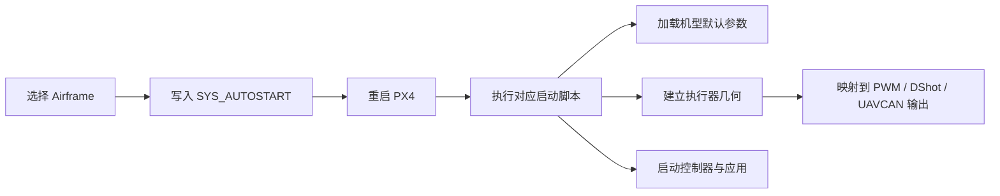
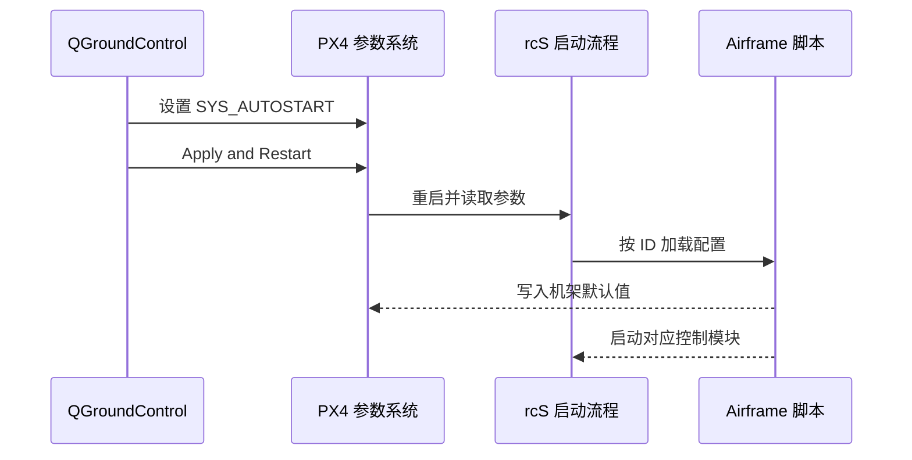
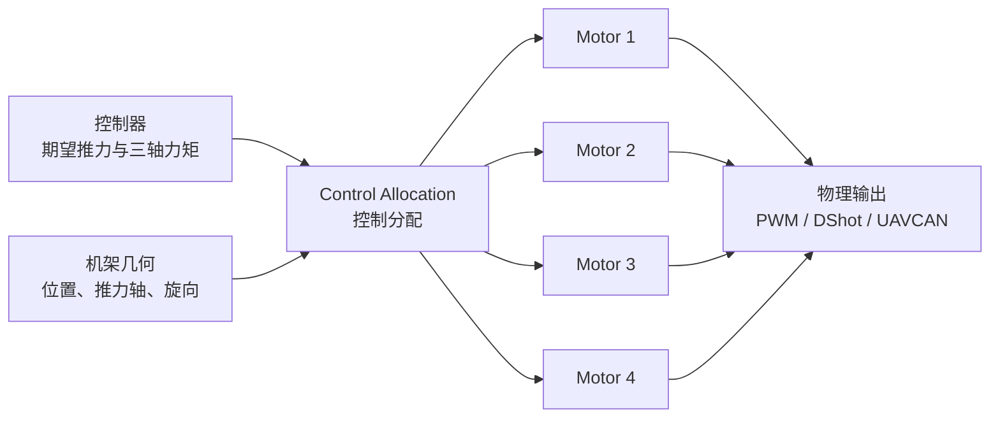

# PX4 机架（Airframe）配置

## 1. Airframe 是什么

Airframe 是 PX4 的**整机启动配置**：用一个编号选择飞行器类型、执行器几何、默认参数及需要启动的控制模块。它不是三维模型，也不等同于电机混控表。

| 对象 | 定义 | 典型内容 |
| --- | --- | --- |
| Airframe | 整机配置入口 | 机型、默认参数、控制模块、执行器几何 |
| Geometry | 执行器相对重心的空间关系 | 电机数量、位置、推力轴、旋向 |
| Output Mapping | 逻辑执行器到物理接口的映射 | `Motor 1 → PWM MAIN 1` |
| Tuning | 具体整机的控制参数 | PID、悬停油门、速度与倾角限制 |



**核心关系：**Airframe 决定“这是什么飞行器以及默认如何工作”；Actuators 页面决定“每个电机或舵机在哪里、接到哪个输出口”。

## 2. `SYS_AUTOSTART`：机架配置索引

Airframe 文件名格式为：

```text
<SYS_AUTOSTART>_<机架名称>
```

例如 `4001_quad_x` 中，`4001` 是机架 ID。QGroundControl 选择机架并应用后，会设置 `SYS_AUTOSTART`；PX4 重启时据此执行相应脚本。不同 PX4 版本的 ID 和文件名可能变化，应以当前源码或 QGroundControl 列表为准。



## 3. 四旋翼 X 的几何含义

PX4 使用 **FRD** 机体系，坐标原点应取整机重心：

- `+X`：机头（Forward）
- `+Y`：机体右侧（Right）
- `+Z`：机体下方（Down）

```text
                         +X 机头
                            ↑
              Motor 3       │       Motor 1
             (+X, -Y)       │      (+X, +Y)
                      ╲      │      ╱
                       ╲     ●     ╱       ●：整机重心
              -Y 左侧 ──────┼────── +Y 右侧
                       ╱           ╲
                      ╱             ╲
              Motor 2               Motor 4
             (-X, -Y)              (-X, +Y)
                            ↓
                         -X 机尾
```

上图对应 PX4 通用 Quad X 的电机编号与相对位置。旋向、输出口和电机编号必须以当前固件的 **Actuators → Actuator Testing** 为最终依据；不要按接线顺序或其他飞控生态的编号习惯推断。

## 4. 控制分配如何使用机架几何

控制器输出的是整机期望力和力矩，控制分配器再利用几何参数求出各执行器指令：



多旋翼常见几何参数：

| 参数族 | 含义 | 注意点 |
| --- | --- | --- |
| `CA_ROTOR_COUNT` | 电机数量 | 必须与实机一致 |
| `CA_ROTORn_PX/PY/PZ` | 第 `n+1` 个电机相对重心的位置 | 单位通常为米；使用 FRD 坐标 |
| `CA_ROTORn_AX/AY/AZ` | 电机推力轴方向 | 倾转或非平行布局必须正确填写 |
| `CA_ROTORn_KM` | 反扭矩系数 | 符号反映旋向 |
| `PWM_*_FUNCn` | 物理输出通道功能 | `101` 起通常对应 Motor 1、Motor 2…… |

> `Position X/Y/Z` 是执行器相对**整机重心**的位置，不一定是相对飞控安装点的位置。

## 5. 源码中的位置与结构

| 目标 | 路径 |
| --- | --- |
| NuttX 实机 Airframe | `ROMFS/px4fmu_common/init.d/airframes/` |
| POSIX/SITL Airframe | `ROMFS/px4fmu_common/init.d-posix/airframes/` |
| Airframe 构建清单 | `ROMFS/px4fmu_common/init.d/airframes/CMakeLists.txt` |
| 通用多旋翼默认配置 | `ROMFS/px4fmu_common/init.d/rc.mc_defaults` |
| 总启动入口 | `ROMFS/px4fmu_common/init.d/rcS` |

Airframe 脚本通常包含四类内容：

1. 元数据：名称、类型、类别、维护者，用于生成 QGroundControl 机架列表。
2. 通用默认值：加载多旋翼、固定翼、VTOL 等公共配置。
3. 专用参数：几何、输出映射、PID、悬停油门和限制值。
4. 应用启动：仅在特殊机型需要时显式启动专用模块。

## 6. 新建自定义 Airframe

### 6.1 工程化开发流程

自定义 Airframe 的目标不是保存某一架飞机的全部参数，而是形成一套**同型号飞行器可复用、刷写后可恢复、能够回归验证的默认配置**。

| 阶段 | 关键操作 | 产物 | 通过条件 |
| --- | --- | --- | --- |
| 1. 固定基线 | 记录 PX4 版本/提交、飞控板、机型、执行器数量及输出协议 | 基线清单 | 源码版本和硬件对象唯一确定 |
| 2. 选择母版 | 选择控制类型一致的 Generic Airframe；品牌机架仅在硬件、几何和动力系统均接近时使用 | 母版脚本、原始 `SYS_AUTOSTART` | 多旋翼/固定翼/VTOL 控制链正确，旋翼或舵面类型一致 |
| 3. 建立几何 | 按 FRD 坐标填写执行器相对重心的位置、推力轴、旋向和倾转关系 | `CA_*` 参数集 | 数量、编号、坐标、轴向与实机逐项一致 |
| 4. 映射输出 | 将 Motor/Servo 功能分配到 PWM、DShot 或 UAVCAN 通道，并设置协议、频率、正反向和失效值 | `PWM_*`、`DSHOT_*`、`UAVCAN_*` 等参数 | 拆桨测试中逻辑执行器与物理接口一一对应 |
| 5. 完成整机参数 | 配置机型专用限制、悬停油门、控制增益及必要的功能开关 | 可飞行参数集 | 基础模式稳定，任务所需功能可用，无持续饱和或振荡 |
| 6. 提取差异 | 在 MAVLink Console 执行 `param show-for-airframe`，与母版默认值比较 | 候选差异表 | 每个差异都能说明来源和用途 |
| 7. 参数分层 | 将可复用的机型参数写入脚本；剔除单机校准、设备 ID、任务和临时调试参数 | 最小默认参数集 | 换一块同型号飞控后仍能使用，且不会继承上一架飞机的校准数据 |
| 8. 固化源码 | 分配未占用 ID，创建 `<ID>_<name>`，补齐元数据，并加入 `CMakeLists.txt` | Airframe 脚本、构建清单修改 | `make airframe_metadata` 能识别新机架 |
| 9. 构建部署 | 执行干净构建、刷写自定义固件；必要时重置参数后重新选择机架 | `.px4` 固件、构建日志 | QGC 可见新机架，`SYS_AUTOSTART` 为新 ID |
| 10. 回归验收 | 依次验证冷启动、传感器、执行器、解锁、基础飞行、失效保护和重启持久性 | 验收记录、参数备份 | 所有检查通过且无依赖手工补参的隐藏步骤 |

参数是否应写入 Airframe，可按下表判断：

| 建议固化 | 通常不固化 |
| --- | --- |
| 执行器数量、位置、推力轴和旋向 | 加速度计、陀螺仪、磁力计的单机校准值 |
| 电机/舵机功能与默认输出映射 | 传感器序列号、设备 ID、校准优先级 |
| 该型号统一使用的控制增益与飞行限制 | 遥控器校准、绑定信息和个人手感参数 |
| 该型号必需的模块开关和安全默认值 | 航点任务、地理围栏、日志及临时调试参数 |
| 同批次统一的动力模型和悬停油门初值 | 电池实测容量、单机偏差和一次性测试值 |

> `param set-default` 修改的是默认值；飞控中已保存的参数可能继续覆盖它。验证新机架时应使用明确的参数重置策略，不能仅凭重新刷写固件判断默认值已经生效。

### 6.2 最小脚本模板

文件名示例：`4999_my_quad_x`

```sh
#!/bin/sh
#
# @name My Quad X
#
# @type Quadrotor x
# @class Copter
#
# @maintainer Your Name <you@example.com>
#

# 加载多旋翼通用默认参数与启动逻辑
. ${R}etc/init.d/rc.mc_defaults

# 定义四个旋翼及其相对重心的位置
param set-default CA_ROTOR_COUNT 4
param set-default CA_ROTOR0_PX 0.15
param set-default CA_ROTOR0_PY 0.15
param set-default CA_ROTOR1_PX -0.15
param set-default CA_ROTOR1_PY -0.15
param set-default CA_ROTOR2_PX 0.15
param set-default CA_ROTOR2_PY -0.15
param set-default CA_ROTOR3_PX -0.15
param set-default CA_ROTOR3_PY 0.15

# 将前四个主输出依次映射为 Motor 1 至 Motor 4
param set-default PWM_MAIN_FUNC1 101
param set-default PWM_MAIN_FUNC2 102
param set-default PWM_MAIN_FUNC3 103
param set-default PWM_MAIN_FUNC4 104
```

该模板只演示文件结构，`KM`、推力轴、输出总线、控制参数和真实尺寸必须根据实机填写。新增文件后，将文件名加入同目录 `CMakeLists.txt` 的对应机型分组。

### 6.3 编译与刷写

首次加入新 Airframe 时需要清理构建缓存：

```bash
make clean
make px4_fmu-v5_default
```

生成固件：

```text
build/px4_fmu-v5_default/px4_fmu-v5_default.px4
```

在 QGroundControl 中选择 **Firmware → Advanced settings → Custom firmware file** 刷写该文件，重启 QGroundControl 后再选择新机架。

不改固件也可测试 Airframe 脚本：将脚本命名为 `rc.autostart`，复制到 SD 卡的 `/ext_autostart/rc.autostart`。此方式适合快速验证，正式版本仍建议固化进源码并纳入版本管理。

## 7. 调试与验收

拆除螺旋桨后依次检查：

| 检查项 | 判定标准 |
| --- | --- |
| 机架类型 | QGC 显示的类型、旋翼数量与实机一致 |
| 坐标与重心 | 电机位置按 FRD、相对整机重心填写 |
| 电机编号 | Actuator Testing 单独测试时，响应电机与图示一致 |
| 电机旋向 | 每个电机实际旋向与 QGC 几何配置一致 |
| 输出映射 | Motor/Servo 功能与物理接口一一对应 |
| 推力方向 | 正输出产生预期方向的力；倾转轴定义正确 |
| 故障保护 | 遥控、数传、定位和电源失效行为符合设计 |
| 参数持久性 | 重启后 `SYS_AUTOSTART` 与自定义默认值正确保留 |

若机体在起飞瞬间快速侧翻，优先检查**电机编号、旋向、桨叶方向、飞控朝向和机架几何**，不要先调整 PID。

## 8. 参考资料

- [PX4：添加机架配置](https://docs.px4.io/main/en/dev_airframes/adding_a_new_frame)
- [PX4：系统启动流程](https://docs.px4.io/main/en/concept/system_startup)
- [PX4：执行器配置与测试](https://docs.px4.io/main/en/config/actuators)
- [PX4：机架选择](https://docs.px4.io/v1.17/en/config/airframe)
