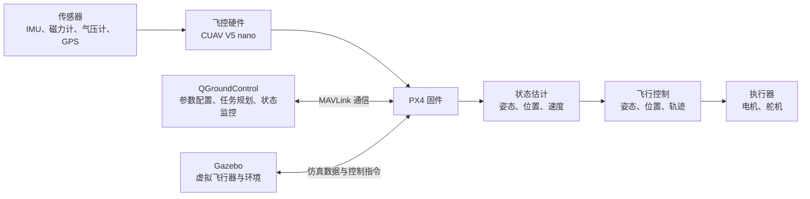
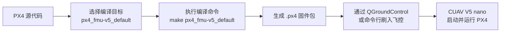

# PX4 与自定义固件

## 1. PX4 是什么？

PX4 是一套运行在飞控计算机上的**开源自动驾驶仪软件平台**。它以实时操作系统为运行基础，负责读取传感器数据、估计飞行器状态、执行控制算法、输出电机或舵机指令，并完成航点飞行、返航等任务管理。

简单来说：**飞控硬件是飞行器的“身体”，PX4 是让这套硬件能够感知、判断和控制飞行的“神经系统”。**

### 1.1 PX4 在飞行系统中的位置



上图展示了 PX4 的核心工作链路：传感器产生原始数据，PX4 先估计飞行器当前状态，再根据飞行目标计算控制量，最后通过飞控硬件向电机或舵机输出指令。

### 1.2 几个容易混淆的概念

| 名称 | 类型 | 主要作用 | 与 PX4 的关系 |
| --- | --- | --- | --- |
| **PX4** | 飞控软件 | 状态估计、飞行控制、任务管理和设备驱动 | 系统的核心软件 |
| **CUAV V5 nano** | 飞控硬件 | 提供处理器、传感器接口和执行器接口 | 用来运行 PX4 固件 |
| **QGroundControl** | 地面站软件 | 刷写固件、配置参数、校准传感器、规划任务和监控飞行 | 通过 MAVLink 与 PX4 通信 |
| **Gazebo** | 仿真环境 | 模拟飞行器、传感器和外部环境 | 在没有真实飞行器时验证 PX4 |
| **FMU-v5** | 硬件参考架构 | 规定一代飞控的处理器、存储和接口等硬件特征 | 决定 PX4 编译时使用的目标配置 |

> **注意：**CUAV V5 nano 是一块具体的飞控板，FMU-v5 是硬件架构类别；二者不是同一个概念。该飞控板采用 FMU-v5 架构，因此可以使用对应的 PX4 编译目标。

### 1.3 PX4 内部主要做什么？

PX4 可以从功能上理解为以下几个部分：

1. **设备驱动**：读取 IMU、GPS、磁力计、气压计等传感器，并控制电机、舵机等执行器。
2. **状态估计**：融合多个传感器的数据，得到姿态、位置、速度等飞行状态。
3. **飞行控制**：根据目标状态与当前状态之间的误差，计算需要的力和力矩。
4. **控制分配**：把期望的力和力矩转换成各个电机或舵机的具体输出。
5. **任务与安全管理**：负责飞行模式、航点任务、起飞、降落、返航和故障保护。
6. **通信**：通过 MAVLink 与 QGroundControl、伴随计算机或其他设备交换数据。

### 1.4 从源代码到飞行器运行



针对 FMU-v5 架构，可以在 PX4 源代码目录中执行：

```bash
make px4_fmu-v5_default
```

编译成功后，通常会生成以下固件文件：

```text
build/px4_fmu-v5_default/px4_fmu-v5_default.px4
```

这个 `.px4` 文件是用于刷写的固件包，其中包含 PX4 程序、板级配置和相关元数据。将它刷入 CUAV V5 nano 后，飞控板才能按照这份程序完成传感器采集、状态估计和飞行控制。

### 1.5 一句话梳理它们的关系

> **PX4 是飞控软件，CUAV V5 nano 是运行它的硬件，FMU-v5 是该硬件所属的参考架构，QGroundControl 用来配置和监控它，Gazebo 用来在虚拟环境中验证它。**

## 2. 自定义固件是什么？

自定义固件是由经过修改或重新配置的 PX4 源代码编译得到的固件。与官方默认固件相比，它可能包含项目专用的功能、算法、驱动或参数配置。

常见的自定义内容包括：

- 修改姿态、位置或轨迹控制器；
- 修改 EKF 等状态估计算法；
- 调整控制分配逻辑或适配特殊机型；
- 添加新的传感器、执行器或通信设备驱动；
- 增加自定义 PX4 模块和 uORB 消息；
- 修改板级配置、默认参数或启动脚本。

建议在 GitHub 仓库中为自定义修改建立独立分支，例如：

```text
main                 官方或稳定基线
└── custom-firmware  自定义固件开发分支
```

这样可以清楚地区分官方代码与项目修改，也方便后续同步 PX4 上游更新、开展代码审查和回退版本。
